# Modern Social Media App (Flutter + Firebase + BLoC Cubit)

A **feature-rich social media application** built with **Flutter**, **Firebase**, and **BLoC Cubit**, showcasing real-time interactions, profile management, and smooth UI experience.

---

## Features

### Home Feed

- Like, comment, and delete posts.
- View post timestamps.
- Smooth scrolling with **cached network images** for better performance.

### Profile

- Displays post count, followers, following.
- Shows user bio, email, and profile picture.
- Update profile photo and bio easily.

### Social Interaction

- Follow/unfollow users.
- Navigate through followers and following lists.

### Search

- Search for users by name.
- Navigate to user profiles directly from search.

### Settings

- Toggle between **dark mode** and **light mode**.

### Authentication

- Firebase-powered **login and registration**.
- Secure and real-time authentication handling.

---

## Tech Stack

- **Flutter**: Cross-platform UI development.
- **Firebase**: Firestore, Authentication, and Storage.
- **BLoC Cubit**: State management for reactive UI.
- **cached_network_image**: Efficient image caching for smooth performance.

---

## Screenshots

<table>
  <!-- Row 1 -->
  <tr>
    <td>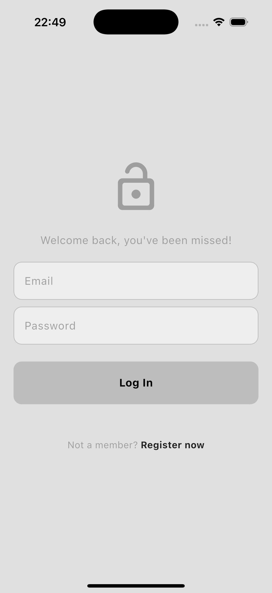</td>
    <td>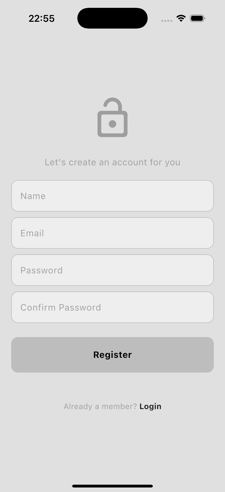</td>
    <td>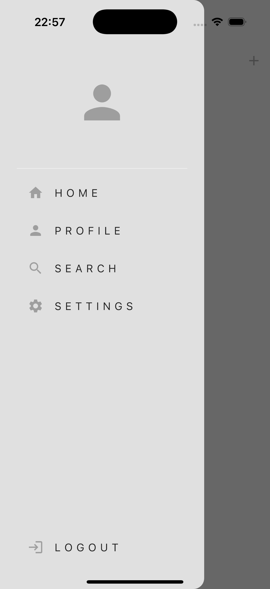</td>
  </tr>
  <!-- Row 2 -->
  <tr>
    <td>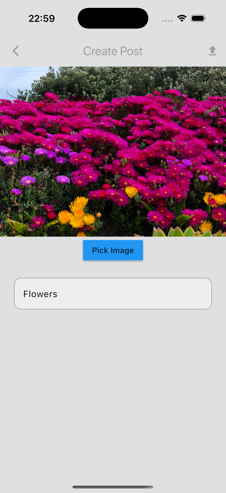</td>
    <td>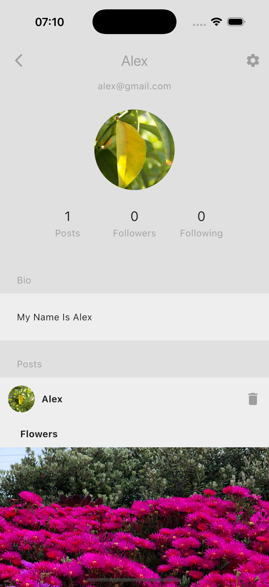</td>
    <td>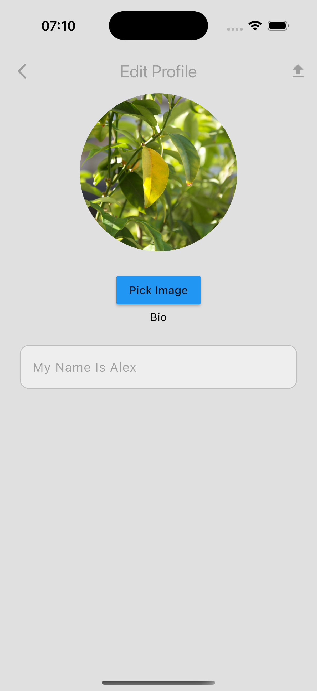</td>
  </tr>
  <!-- Row 3 -->
  <tr>
    <td>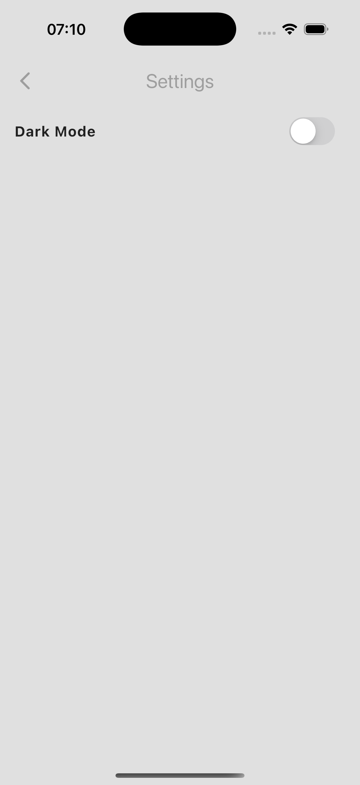</td>
    <td>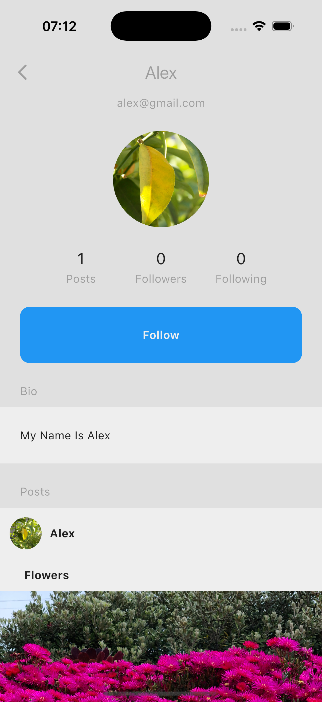</td>
    <td>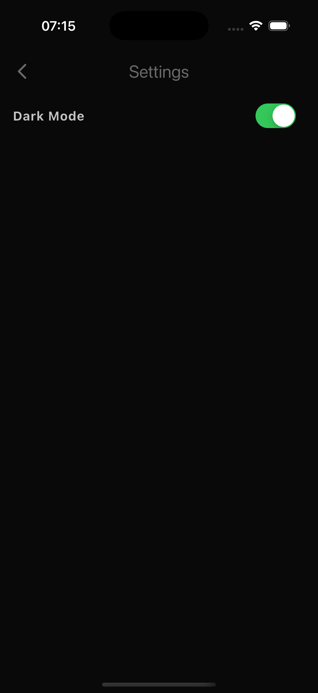</td>
  </tr>
  <!-- Row 4 -->
  <tr>
    <td>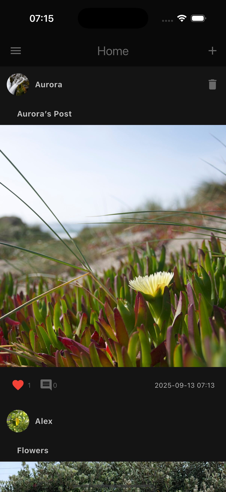</td>
    <td>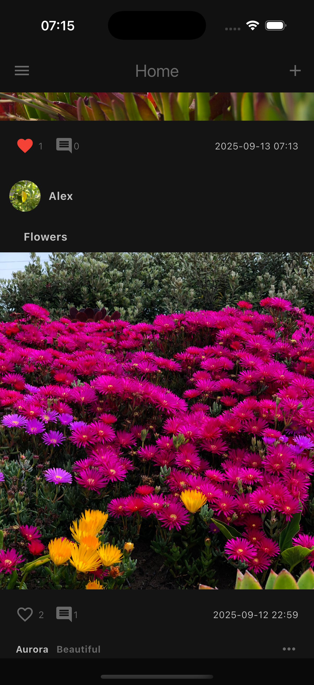</td>
    <td>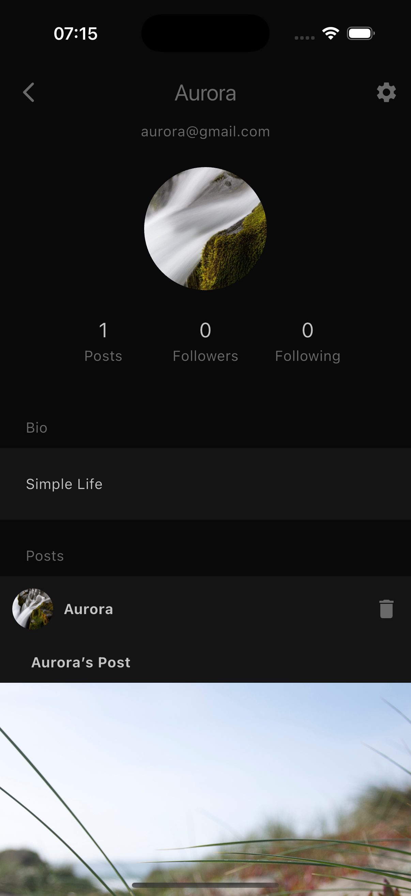</td>
  </tr>
  <!-- Row 5 -->
  <tr>
    <td>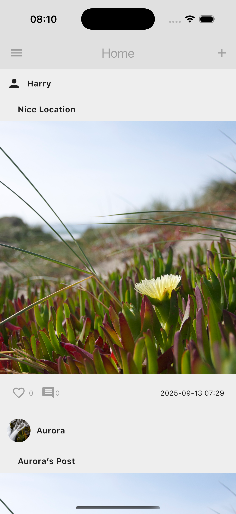</td>
  </tr>
</table>

---

## Getting Started

### Prerequisites

- Flutter SDK installed
- Firebase project setup
- IDE: VS Code or Android Studio

### Installation

1. Clone this repository:

```bash
git clone https://github.com/mrnipundilshan/social-app.git
```
